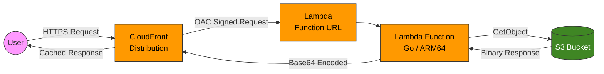
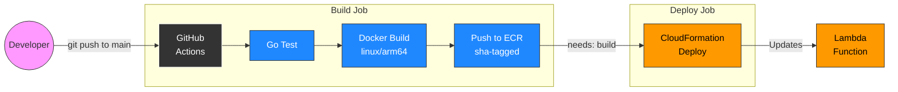

# AWS Asset Proxy

A serverless asset delivery service built on AWS. It proxies requests to objects stored in S3 through a Lambda function, fronted by CloudFront for global edge caching and low-latency delivery.

## Architecture



### Request Flow

1. A user makes an HTTPS request to the CloudFront distribution URL (e.g., `https://<dist-id>.cloudfront.net/images/logo.png`).
2. CloudFront checks its edge cache. On a cache miss, it forwards the request to the Lambda Function URL.
3. The request is signed using **Origin Access Control (OAC)** with SigV4, so the Lambda Function URL only accepts requests from CloudFront (AuthType: `AWS_IAM`).
4. The Lambda function extracts the object key from the URL path, fetches the corresponding object from S3, and returns it base64-encoded with the correct `Content-Type`.
5. CloudFront caches the response at the edge for subsequent requests.

### CI/CD Flow



1. A developer pushes code to the `main` branch. The pipeline only triggers on changes to `app/`, `infra/`, or the workflow file itself.
2. **Build Job**: GitHub Actions runs Go tests, builds a Docker image for `linux/arm64` (with BuildKit cache mounts for Go modules and build artifacts), and pushes it to ECR with an immutable short-SHA tag.
3. **Deploy Job**: Automatically dispatched after a successful build. It deploys the updated CloudFormation stack with the new image URI.
4. Authentication to AWS is handled via **OIDC** (no long-lived credentials stored in GitHub).

## Tech Stack

| Layer          | Technology                                             |
| -------------- | ------------------------------------------------------ |
| Language       | Go 1.22                                                |
| Runtime        | AWS Lambda (`provided.al2023`, Docker image, ARM64)    |
| Storage        | Amazon S3                                              |
| CDN            | Amazon CloudFront (with OAC for Lambda)                |
| IaC            | AWS CloudFormation                                     |
| CI/CD          | GitHub Actions (OIDC authentication)                   |
| Container      | Multi-stage Dockerfile, ECR                            |

## Project Structure

```text
aws-asset-proxy/
├── .github/workflows/ci-cd.yml   # CI/CD pipeline
├── app/                           # Go Lambda function + Dockerfile
├── infra/
│   ├── app.yaml                   # Main stack (S3, Lambda, CloudFront)
│   └── github-oidc.yaml          # OIDC stack (GitHub Actions role)
├── samples/                       # Demo assets uploaded by setup script
├── config.env                     # Shared environment variables
└── setup-env.sh                   # One-time bootstrap script
```

## Prerequisites

- **AWS CLI** configured with credentials that have permissions to deploy CloudFormation stacks
- **Docker** with [Buildx](https://docs.docker.com/reference/cli/docker/buildx/) enabled (used by the bootstrap script for local ARM64 builds; not needed for CI/CD — GitHub Actions handles Docker builds independently)
- **Go 1.22+** (for local development and testing)
- A **GitHub repository** to host the code and run Actions

## Getting Started

### 1. Fork and Clone

Fork this repository to your own GitHub account, then clone your fork:

```bash
git clone https://github.com/<your-github-username>/aws-asset-proxy.git
cd aws-asset-proxy
```

### 2. Configure Environment Variables

Edit `config.env` to match your GitHub username and AWS environment:

```env
AWS_REGION=eu-central-1
ECR_REPOSITORY=asset-proxy
STACK_NAME=asset-proxy-stack
GITHUB_ORG=your-github-username
GITHUB_REPO=aws-asset-proxy
OIDC_STACK_NAME=github-oidc-stack
```

### 3. Run the Bootstrap Script

The `setup-env.sh` script performs a one-time setup that provisions everything from scratch:

```bash
chmod +x setup-env.sh
./setup-env.sh
```

This script will:

1. Deploy the **GitHub OIDC stack** (`github-oidc.yaml`) — creates the OIDC identity provider and a least-privilege IAM role for GitHub Actions.
2. Create the **ECR repository** if it doesn't exist.
3. Build and push a **bootstrap Docker image** (ARM64) to ECR.
4. Deploy the **application stack** (`app.yaml`) — provisions S3, Lambda, CloudFront, and all supporting resources.
5. Upload a **sample asset** from `samples/` to S3 and print the CloudFront URL for immediate testing.
6. Output the **IAM Role ARN** that needs to be added to GitHub.

### 4. Configure GitHub Actions

After the script completes, it will print an `AWS_ROLE_ARN`. Add it as a **Repository Variable** (not a Secret) in GitHub:

Go to: Settings → Secrets and variables → Actions → Variables → New repository variable

| Name           | Value                                                    |
| -------------- | -------------------------------------------------------- |
| `AWS_ROLE_ARN` | The Role ARN printed by the setup script                 |

> **Note:** The Role ARN is stored as a variable (not a secret) because ARNs are not sensitive. Keeping it visible makes debugging easier since GitHub won't mask it in pipeline logs.

### 5. Push to Main

Once the variable is configured, pushes to `main` that modify `app/`, `infra/`, or the workflow file will trigger the CI/CD pipeline:

```bash
git push origin main
```

## Running Tests Locally

```bash
cd app
go test -v ./...
```

The tests use a **mocked S3 interface** (`S3Getter`) to verify the Lambda handler logic without requiring AWS credentials or network access. Test scenarios include:

| Test Case                    | Validates                                       |
| ---------------------------- | ----------------------------------------------- |
| Successful request           | Object is fetched, base64-encoded, and returned |
| Empty path                   | Returns `400 Bad Request`                       |
| Object not found (NoSuchKey) | Returns `404 Not Found`                         |
| Object not found (API Error) | Handles SDK v2 generic API errors correctly     |
| Internal server error        | Generic S3 failures return `500`                |

## Testing the Deployed Service

The setup script automatically uploads a sample asset and prints the CloudFront URL. You can test it immediately:

```bash
# The setup script prints this URL — open it in a browser or use curl
curl https://<distribution-domain>.cloudfront.net/aws.png
```

To upload additional assets:

```bash
# Get the stack outputs (bucket name, CloudFront URL)
aws cloudformation describe-stacks \
  --stack-name asset-proxy-stack \
  --query "Stacks[0].Outputs" \
  --output table

# Upload a file
aws s3 cp ./my-file.png s3://<bucket-name>/my-file.png

# Access it via CloudFront
curl https://<distribution-domain>.cloudfront.net/my-file.png
```

## Infrastructure Details

### Application Stack (`infra/app.yaml`)

| Resource                          | Type                              | Purpose                                                          |
| --------------------------------- | --------------------------------- | ---------------------------------------------------------------- |
| `AssetBucket`                     | S3 Bucket                         | Stores the assets to be served                                   |
| `LambdaExecutionRole`             | IAM Role                          | Grants the Lambda `s3:GetObject` and `s3:ListBucket` permissions |
| `AssetProxyFunction`              | Lambda Function                   | Go binary running on ARM64 (`provided.al2023`)                   |
| `AssetProxyFunctionUrl`           | Lambda Function URL               | HTTP(S) endpoint for the Lambda (AuthType: AWS_IAM)              |
| `CloudFrontOAC`                   | CloudFront Origin Access Control  | Signs requests to Lambda with SigV4                              |
| `AssetProxyDistribution`          | CloudFront Distribution           | Edge-cached CDN in front of the Lambda                           |
| `LambdaInvokeUrlPermission`       | Lambda Permission                 | Allows CloudFront to invoke the Lambda Function URL              |
| `LambdaInvokeFunctionPermission`  | Lambda Permission                 | Allows CloudFront to invoke the Lambda Function directly         |

### OIDC Stack (`infra/github-oidc.yaml`)

| Resource             | Type              | Purpose                                            |
| -------------------- | ----------------- | -------------------------------------------------- |
| `GitHubOIDCProvider` | IAM OIDC Provider | Trusts GitHub Actions as an identity provider      |
| `GitHubActionsRole`  | IAM Role          | Least-privilege role assumed by the CI/CD pipeline |

The OIDC role uses `StringLike` conditions to lock access down to a **specific repository**, preventing other GitHub repositories from assuming the role.

## Key Features & Security

- **No long-lived AWS credentials** — GitHub Actions authenticates via OIDC with short-lived tokens.
- **Least-privilege IAM** — The deployment role is scoped to only the resources it needs (CloudFormation, S3, Lambda, CloudFront, ECR, IAM) with resource-level restrictions.
- **S3 is fully private** — Public access is blocked at the bucket level. Assets are only accessible through CloudFront → Lambda.
- **Lambda Function URL uses `AWS_IAM` auth** — Only CloudFront (via OAC) can invoke the Lambda; direct access is denied.
- **Immutable image tags** — Docker images are tagged with the Git short SHA, ensuring every deployment is traceable and tags are never overwritten.
- **Build caching** — Dockerfile uses BuildKit cache mounts for Go modules and build artifacts, backed by GitHub Actions cache for faster CI builds.
- **Path-filtered CI/CD** — Pipeline only triggers on changes to `app/`, `infra/`, or the workflow file, avoiding unnecessary builds from documentation-only changes.
